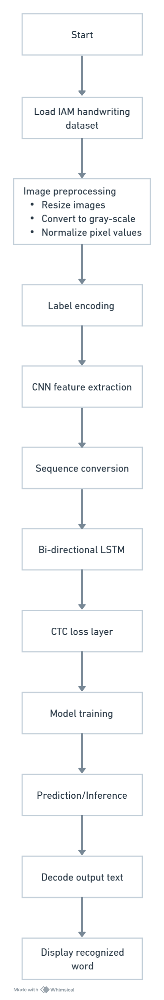
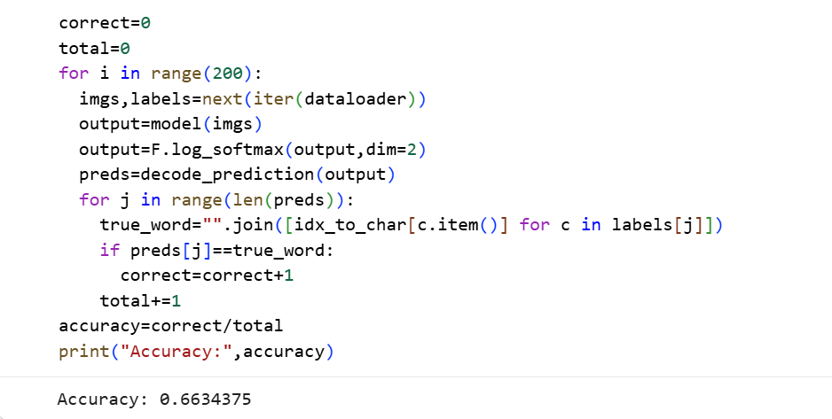
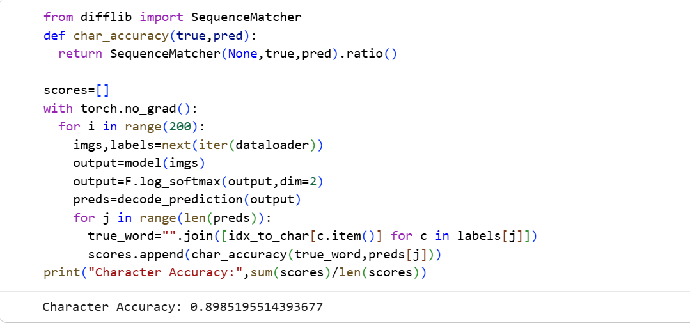
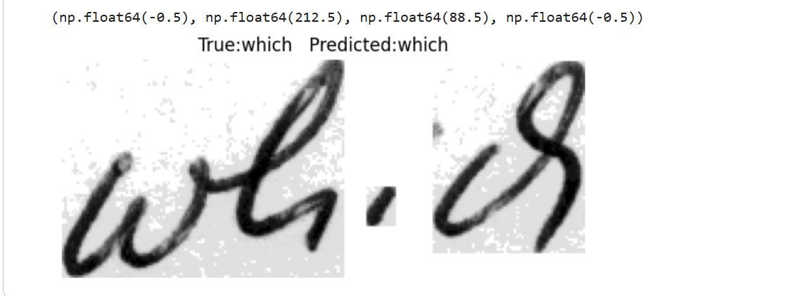
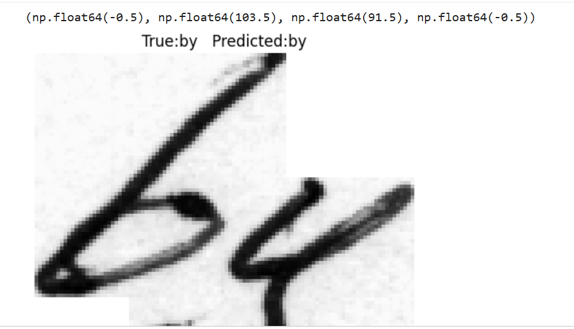
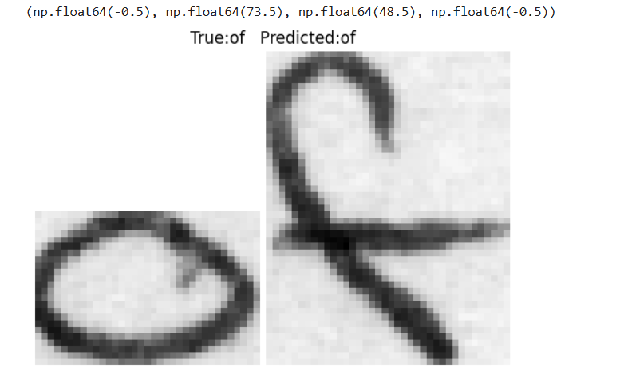
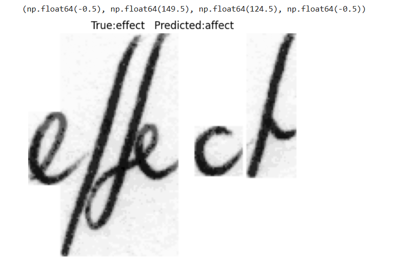
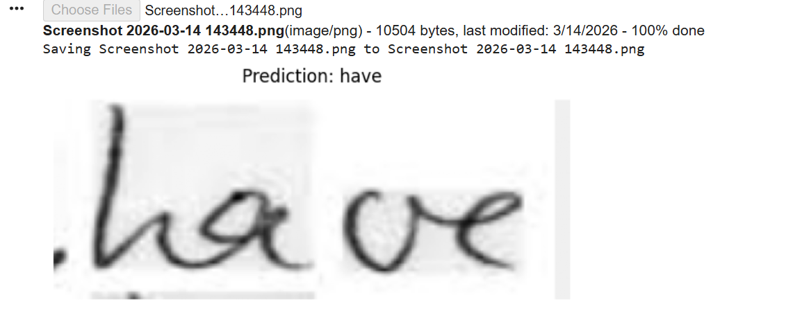

# CRNN Handwritten Word Recognition

**Deep learning model that recognizes handwritten words from images using a Convolutional Recurrent Neural Network (CRNN).**

---

# Project Overview

Handwritten text recognition is an important problem in computer vision and document digitization. This project implements a **Convolutional Recurrent Neural Network (CRNN)** to recognize handwritten words from images. The model combines **Convolutional Neural Networks (CNN)** for extracting visual features and **Recurrent Neural Networks (RNN/LSTM)** for learning sequential dependencies in characters.

The system takes an **image containing a handwritten word**, processes it through the CRNN architecture, and outputs the predicted text. The model was trained on the **IAM Handwriting Dataset**, which contains thousands of labeled handwritten word images from multiple writers.

This project demonstrates how **deep learning can be used to automate handwritten text recognition**, which has applications in document digitization, postal address reading, historical document transcription, and automated form processing.

---

# Dataset & Resources

The following resources were used in this project:

**Dataset**

* **IAM Handwriting Dataset (Kaggle)**
  [https://www.kaggle.com/datasets/nibinv23/iam-handwriting-word-database](https://www.kaggle.com/datasets/nibinv23/iam-handwriting-word-database)

**Libraries & Tools**

* Python
* TensorFlow / Keras
* NumPy
* OpenCV
* Matplotlib
* Google Colab

**Model Architecture**

* CNN layers for feature extraction
* Bidirectional LSTM for sequence modeling
* CTC (Connectionist Temporal Classification) loss for alignment-free training

---

# System Architecture



---

# Model Workflow

The workflow of the handwritten text recognition system is as follows:

1. The user uploads or selects an image containing a handwritten word.
2. The image is preprocessed (resized, normalized, converted to grayscale).
3. The processed image is passed through the **CRNN model**.
4. CNN layers extract spatial features from the image.
5. These features are converted into sequences and passed to **Bidirectional LSTM layers**.
6. The model predicts character probabilities for each time step.
7. **CTC decoding** converts predictions into readable text.
8. The recognized handwritten word is displayed as the final output.

---

# How to Run the Project

### 1: Clone the Repository

```bash
git clone https://github.com/yourusername/crnn-handwriting-recognition.git
cd crnn-handwriting-recognition
```

### 2: Install Dependencies

```bash
pip install tensorflow numpy opencv-python matplotlib
```

### 3: Run the Notebook

Open the notebook in **Google Colab or Jupyter Notebook** and run all cells.

```bash
jupyter notebook
```

Run the notebook to:

* Train the CRNN model
* Evaluate model performance
* Test handwritten word recognition

---

# Results

The model was evaluated using:

* **Training Accuracy**
  
* **Character Accuracy**
   
* **Prediction examples on handwritten words**
  
  
  
  
* **Prediction using online images**
  
The model demonstrates strong performance in recognizing handwritten text from the IAM dataset.


---

# Future Scope

This project can be extended in several ways:

* Train on **larger handwriting datasets** to improve accuracy
* Extend the model to recognize **full sentences instead of single words**
* Build a **Streamlit or web-based interface** for real-time handwriting recognition
* Add **support for multiple languages**
* Deploy the model as a **cloud API or mobile application**
* Apply the system to **historical document digitization and form processing**

---

# Author

**Khushi Gupta**

* Third year
* B.Tech – Artificial Intelligence & Data Science
* KJ Somaiya Institute of Technology
